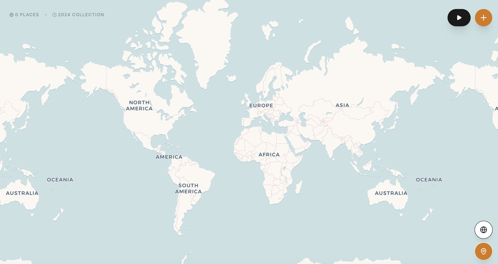
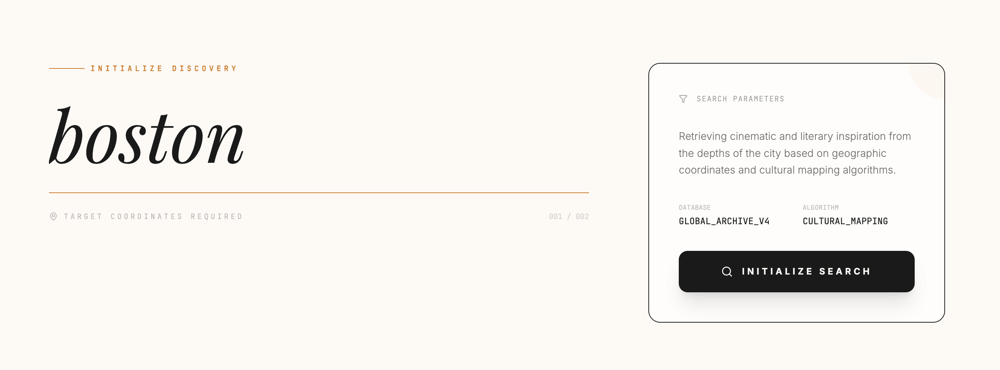
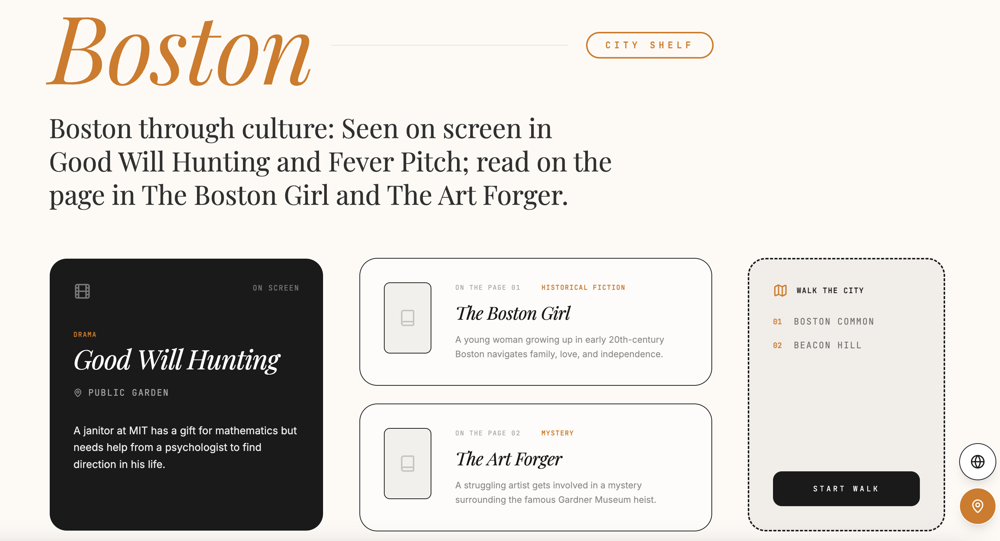

# The Map of Me

  <a href="https://the-map-of-me.vercel.app/">Live Demo</a>

  <em>A cultural atlas for places that mean something.</em>

## Overview

**The Map of Me** is a design-forward web app that transforms saved places into richer cultural entry points.  
Instead of stopping at a map marker, each place can open into a curated layer of discovery: film, literature, and walkable city references.

The project explores a simple idea:

> A place should not end at coordinates. It should open into meaning.

Users begin with a global map, save cities that matter to them, and then move into a more editorial, archive-like interface where a city becomes a **cultural profile**, a **city shelf**, and a **discoverable world**.

**Live site:** [https://the-map-of-me.vercel.app/](https://the-map-of-me.vercel.app/)

## Preview

### 1. World Atlas View

A minimal interactive world map acts as the main entry point.  
Users can begin building a personal collection of places and move from a global atlas into city-level exploration.

### 2. City Shelf / Cultural Profile

Each city expands into a more curated page that combines cinematic and literary references.  
In the current interface, Boston becomes a cultural shelf featuring screen references, books, and walkable landmarks.

### 3. Discovery Initialization Interface

The search/discovery layer frames city exploration as a retrieval process, with an editorial interface that feels part archive, part research terminal.

## Core Idea

Traditional place apps often emphasize:
- pins
- routes
- itineraries
- checklists

**The Map of Me** takes a different direction.

A saved city is not treated as raw geography alone. It can expand into:
- a **cultural summary**
- an **On Screen** module for films and filming references
- an **On the Page** module for books set in or tied to the city
- a **Walk the City** module for iconic local places
- a refined visual layout closer to an exhibition, archive, or editorial object than a utility dashboard

This makes the product feel less like a tracker and more like a **personal atlas of places and cultural memory**.

## Features

### Interactive World Map
- Start from a global atlas view
- Save places into your collection
- Move from world scale to city scale
- Build a growing geography of meaningful locations

### Cultural City Pages
Each place can expand into a richer editorial-style destination page.

A city page may include:
- a short cultural introduction
- film references connected to the city
- books associated with the city
- iconic places to walk through
- a stylized **City Shelf** interface

### On Screen
A module for films or screen works connected to the selected city.

For example, Boston can be framed through:
- *Good Will Hunting*
- *Fever Pitch*

### On the Page
A literary layer featuring novels or books related to the city.

For example:
- *The Boston Girl*
- *The Art Forger*

### Walk the City
A lightweight route or landmark module presenting culturally resonant locations.

For example:
- Boston Common
- Beacon Hill

### Discovery / Archive Layer
The interface also experiments with a more research-oriented mode, where city discovery feels like a curated retrieval process rather than a plain search result.

## Product Structure

The current experience is organized around three main layers:

### 1. Atlas
A world-map overview where places are collected and explored at the global scale.

### 2. City Shelf
A richer city-level page that turns a saved place into a cultural profile.

### 3. Discovery
A more conceptual retrieval/search layer for initializing deeper cultural exploration.

